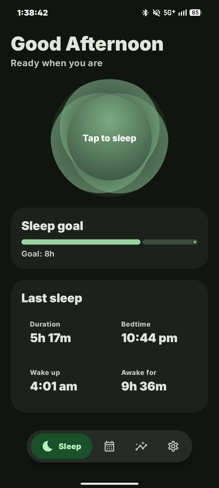
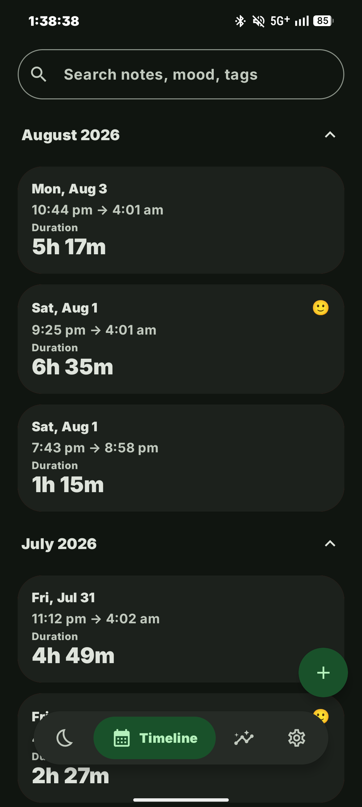
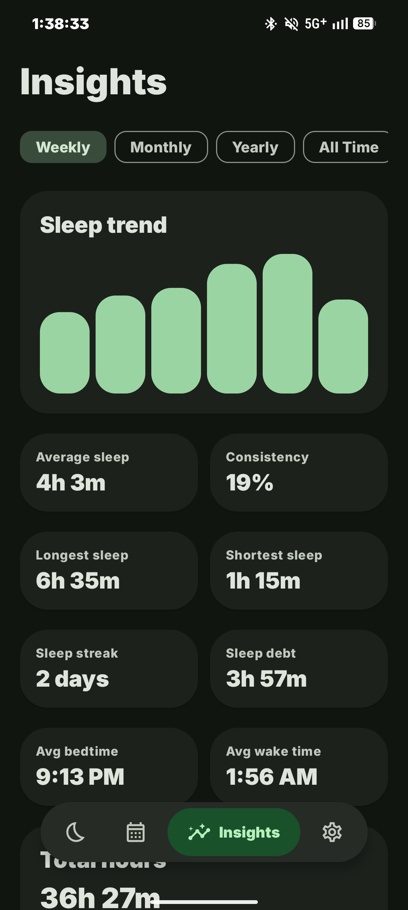
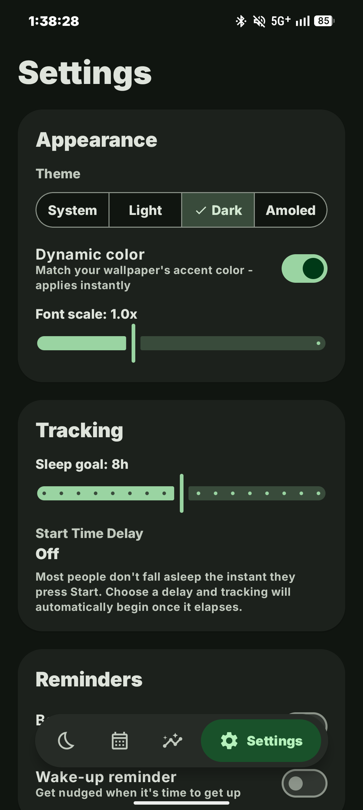

# SleepTracker

> Beautiful, private and modern sleep tracking designed with Material 3 Expressive.

[](https://kotlinlang.org)
[](https://developer.android.com/jetpack/compose)
[](https://m3.material.io/)
[](LICENSE)

SleepTracker is a comprehensive, offline-first Android application built to help you monitor, understand, and improve your sleeping habits. Unlike traditional tracking applications that rely on cloud synchronization and mandatory account creation, SleepTracker empowers you to manage your most personal health data directly on your device.

The application leverages intelligent background services to accurately monitor sleep sessions while maintaining optimal battery efficiency. Detailed daily, weekly, and monthly insights allow you to identify patterns in your rest quality and make informed adjustments to your routine. 

By combining robust technical foundations with a carefully crafted user interface, SleepTracker provides a seamless experience for anyone looking to optimize their sleep hygiene. It serves as both a practical utility and a reference implementation for modern Android development standards.

## Features

- Background sleep tracking utilizing efficient foreground services.
- Comprehensive sleep timeline displaying historical session data.
- Visual analytics via custom-built charts and heatmap grids.
- Built-in secure local backup and restoration management.
- Granular daily sleep notes and subjective quality tagging.
- Automated sleep deficit and consistency calculations.

## Screenshots

<table>
<tr>
<td align="center">

</td>

<td align="center">

</td>

<td align="center">

</td>

<td align="center">

</td>
</tr>
</table>

## Material 3 Expressive

SleepTracker is designed following Google's latest Material 3 Expressive design language, ensuring a premium and tactile user experience. 

- **Dynamic Color (Monet)**: The interface seamlessly adapts its color palette based on your device's wallpaper and theme preferences.
- **Edge-to-edge UI**: Content draws behind system bars for a highly immersive, borderless display.
- **Adaptive layouts**: Carefully optimized structural spacing handles multiple form factors elegantly.
- **Smooth animations**: Every interaction, from navigation to state changes, is accompanied by polished, fluid motion.
- **Modern navigation**: Employs a custom expressive floating navigation bar for ergonomic accessibility.
- **Dark mode**: A deeply integrated dark theme ensures visual comfort during late-night interactions.

## Privacy

Your sleep data is deeply personal. SleepTracker is built entirely around user privacy.

- SleepTracker works locally. All data remains exclusively on your device.
- No tracking or analytics frameworks are embedded in the application.
- No advertisements or external network requests.
- No unnecessary data collection or account requirements.

## Tech Stack

The architecture reflects the latest recommended Android development standards:

- **Kotlin**: Primary language, utilizing the latest language features and safety checks.
- **Jetpack Compose**: Declarative UI toolkit for building native Android interfaces.
- **Material 3 Expressive**: Core design system components and theming.
- **AndroidX**: Support libraries for backward compatibility and lifecycle management.
- **Coroutines**: Asynchronous programming and background task execution.
- **Room**: SQLite object mapping library for robust, type-safe database access.
- **DataStore**: Modern, asynchronous preference storage replacing SharedPreferences.

## Installation

### Requirements
- Android 8.0 (API level 26) or higher.
- Android Studio Iguana (or newer) for building from source.

### Clone
```bash
git clone https://github.com/duxtami/SleepTracker.git
```

### Build with Android Studio
1. Open **Android Studio** and select `Open an existing Project`.
2. Navigate to the cloned directory and select it.
3. Allow Gradle to sync and download the required dependencies.
4. Click the **Run** button (`Shift + F10`) to compile and launch the application on a connected device or emulator.

### Install APK
If you prefer not to compile the project, pre-built APK files are available on the repository's Releases page. Download the latest `app-release.apk` and open it on your Android device to install.

## Project Structure

- `data`: Contains Room database entities, Data Access Objects (DAOs), and DataStore preference management.
- `di`: Houses the application container responsible for manual dependency injection and object scoping.
- `service`: Includes background components such as the `SleepTrackingService` for ongoing session recording.
- `ui`: Houses all Jetpack Compose screens, custom UI components, application navigation graphs, and Material 3 theme configurations.
- `util`: Provides helper functions for date/time formatting, sleep metric calculations, and local backup generation.

## Contributing

We welcome contributions from the open-source community. If you would like to improve SleepTracker, please ensure your changes align with the current architecture and design philosophy.

1. Fork the repository.
2. Create a new branch for your feature or bug fix (`git checkout -b feature-name`).
3. Commit your changes with descriptive messages (`git commit -m "Description of changes"`).
4. Push your branch to the forked repository (`git push origin feature-name`).
5. Open a Pull Request for review.


